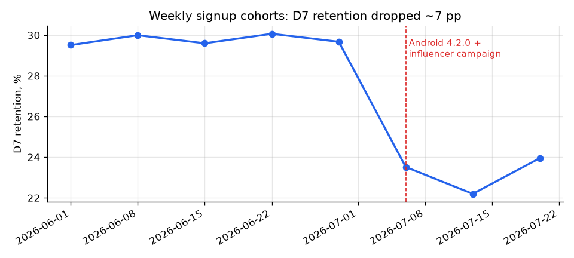
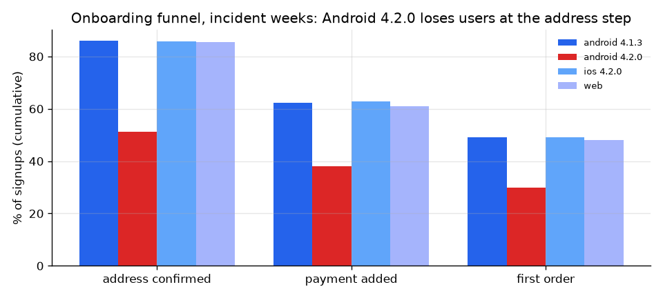
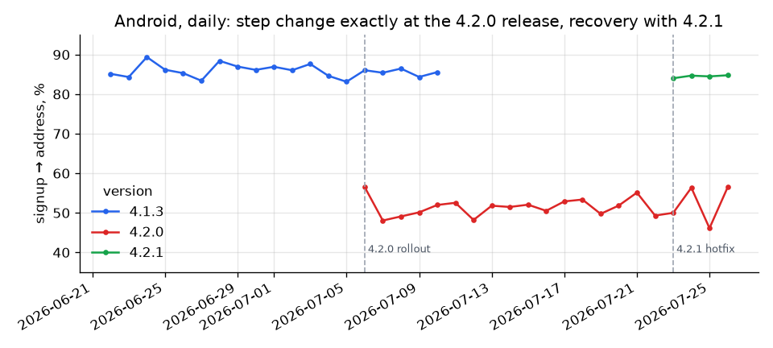
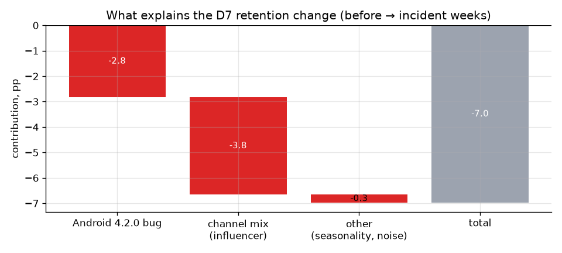

# Why did D7 retention drop by 7 pp? A product-analytics root-cause case

[](https://github.com/kkchillbro/retention-drop-investigation/actions/workflows/ci.yml)   

**TL;DR.** In July, D7 retention of new users for a grocery-delivery app fell from **29.8% to 22.8%** (−7.0 pp, 95% CI −7.8…−6.1). Two causes landed in the same week and hid each other:

| driver | contribution | share |
|---|---|---|
| Android 4.2.0 broke the *address confirmation* screen (signup → address: 86% → 51%) | −2.8 pp | 41% |
| Influencer campaign: 26% of signups, half the retention of other channels | −3.8 pp | 55% |
| Seasonality / noise | −0.3 pp | 5% |

**Recommendations:** ship the hotfix (4.2.1 confirms recovery to 85%), add a release guardrail on onboarding step conversion by platform × version, and judge the influencer campaign on CAC per *retained* user, not per signup.

> **Data disclaimer.** "FreshCart" is a fictional company. Data is synthetic, produced by a seeded generator ([`src/generate_data.py`](src/generate_data.py)) with known planted causes. That makes it possible to check the method against the ground truth, which real data never allows.

---

## 1. The problem

A product manager comes in on Monday: *"Retention of new users fell off a cliff in early July. What happened and what should we do?"*



**Metric:** D7 retention = share of new users with ≥ 1 session on days 7–13 after signup. Grouped by weekly signup cohort.

## 2. Hypothesis tree

Before touching data, list what could move the metric and how to check each item:

| # | hypothesis | how to check | result |
|---|---|---|---|
| H0 | Tracking/data bug, not a real drop | weekly session volume, sessions per active user ([`08_sanity_checks.sql`](sql/08_sanity_checks.sql)) | ❌ no gaps or breaks at the release date |
| H1 | Product change broke something (release) | metric by platform × app version, funnel by step | ✅ **Android 4.2.0, address step** |
| H2 | Acquisition mix changed (new channel) | segment shares before/after, Kitagawa decomposition | ✅ **influencer campaign** |
| H3 | Seasonality (summer) | trend in previous weeks, rate effect after correction | ⚠️ small, −0.3 pp |
| H4 | One city / market problem | metric by city | ❌ −5…−8 pp in every city |

## 3. Analysis

### Step 1. Segment before/after: the trap of one-dimensional slicing
[`sql/05_segment_breakdown.sql`](sql/05_segment_breakdown.sql)

| segment | share before → after | D7 before → after |
|---|---|---|
| android | 49.6% → 49.6% | 30.0% → **20.0%** |
| ios | 44.2% → 44.3% | 29.6% → 25.5% |
| organic | 39.9% → 30.6% | 33.6% → 29.2% |
| influencer | **1.1% → 25.6%** | 14.4% → 12.8% |

Android falls hardest, but iOS and *every* channel fall too. Taken alone, each slice tells a misleading story: the channel view hides the Android bug inside each channel; the platform view hides the mix shift inside iOS. Two drivers have to be separated.

### Step 2. Drill-down into the funnel by version
[`sql/06_funnel_by_version.sql`](sql/06_funnel_by_version.sql)



Only Android 4.2.0 differs, and only at the first step: **signup → address 51.3% vs 85.9%** for other Android versions (−34.7 pp, 95% CI −36.8…−32.5). Address → payment → order conversions are the same, so the loss sits on one screen.

### Step 3. Timing check
[`sql/07_daily_android_address_rate.sql`](sql/07_daily_android_address_rate.sql)



The step change matches the 4.2.0 rollout to the day, and the 4.2.1 hotfix brings the rate back to 85%. Same users, same week, different version: this works as a natural experiment, which is close to causal evidence.

### Step 4. How much does each driver explain?

1. **Bug effect.** For Android 4.2.0 users, replace actual retention with the retention of unaffected users *from the same channel in the same weeks* (counterfactual). Difference = −2.8 pp.
2. **Mix vs rate.** On the bug-corrected data, a [Kitagawa decomposition](https://en.wikipedia.org/wiki/Kitagawa%E2%80%93Oaxaca%E2%80%93Blinder_decomposition) by channel splits the rest into *mix* (channel shares changed) and *rate* (retention within channels changed).



Full numbers: [`reports/findings.md`](reports/findings.md).

## 4. Recommendations

| action | expected impact | owner |
|---|---|---|
| Force-update Android users from 4.2.0 to 4.2.1 | recovers ~230 retained users/week | Mobile |
| Release guardrail: alert if any onboarding step drops > 5 pp for a platform × version with n ≥ 300 | this incident would have been caught on day 1, not week 2 | Analytics + QA |
| Re-evaluate influencer campaign on **CAC per retained user**; segment creators by retention of their audience | budget moves to creators with retention ≥ paid social | Marketing |
| Report retention with a channel-mix-adjusted version next to the raw metric | stops mix shifts from looking like product problems | Analytics |

## 5. Limitations

- Synthetic data: effects are cleaner than in production (no tracking gaps, no overlapping releases).
- The counterfactual assumes unaffected users in the same channel are comparable to affected ones. Platform-level differences in user value would bias it. A cleaner check is a staged rollout with a holdout.
- Kitagawa mix/rate depends on segmentation granularity: a finer split (channel × city) moves part of "rate" into "mix".
- Two incident weeks only. The influencer effect may change as the campaign targets different audiences.

## How to run

```bash
pip install -r requirements.txt
make data        # generate data/users.csv, data/events.csv (60k users, ~370k events)
make analysis    # figures + reports/findings.md
make test        # unit tests: z-test, decomposition, generator

# optional, SQL version of every step
createdb freshcart && make sql DB=freshcart
```

## Repo structure

```
├── src/generate_data.py      # seeded synthetic data with planted root causes
├── src/analysis.py           # pandas analysis, stats tests, charts, findings.md
├── sql/                      # PostgreSQL: schema, load, analysis steps, sanity checks
├── reports/findings.md       # auto-generated numbers
├── reports/figures/          # charts used above
└── tests/                    # unittest
```

**Skills shown:** metric definition, hypothesis tree, segmentation, funnel analysis, natural experiment, counterfactual estimation, mix/rate decomposition, two-proportion z-test with CI, impact sizing, PostgreSQL (CTE, FILTER, window functions), pandas.
